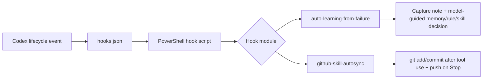

<div align="center">

# Codex Hooks

Reusable lifecycle hooks for Codex: install local automations, preserve hard-won lessons, and keep skill repositories synced.

[](#install)
[](#hooks)
[](https://github.com/Harzva/codex-hooks)

</div>

## Why This Exists

Codex hooks are useful when a task should happen automatically at a lifecycle point: after a tool runs, before a turn stops, or when a new session begins. This repository packages those automations as small, reviewable modules that can be installed into the local Codex home:

```text
%USERPROFILE%\.codex
```

The goal is not to make Codex noisier. The goal is to make repeated operational work disappear: commit the right skill changes, record lessons from repeated failures, and keep hook behavior versioned in Git.

## Hooks

| Hook | Events | What it does | Best for |
| --- | --- | --- | --- |
| [`auto-learning-from-failure`](hooks/auto-learning-from-failure) | `Stop` | Detects repeated failure signals, writes a capture note, and asks Codex to preserve the lesson as a `memory`, `rule`, or `skill` when appropriate. | Avoiding the same mistake in a future thread. |
| [`github-skill-autosync`](hooks/github-skill-autosync) | `PostToolUse`, `Stop` | Auto-commits GitHub-backed skill repo changes after tool use, then pushes at the end of the Codex turn. | Keeping local Codex skill repositories backed up. |

## Install

Install every hook module:

```powershell
.\install.ps1 -Hook all
```

Install one module:

```powershell
.\install.ps1 -Hook auto-learning-from-failure
.\install.ps1 -Hook github-skill-autosync
```

Preview changes without writing files:

```powershell
.\install.ps1 -Hook all -DryRun
```

Install into a custom Codex home:

```powershell
.\install.ps1 -Hook all -CodexHome "C:\Users\you\.codex"
```

The installer enables hooks in `config.toml`:

```toml
[features]
codex_hooks = true
```

It also writes `hooks.json` as UTF-8 without BOM, because Codex's hook parser expects the JSON file to begin directly with `{`.

## How It Works



## Repository Layout

```text
codex-hooks/
  README.md
  install.ps1
  hooks/
    auto-learning-from-failure/
      README.md
      codex/hooks.json
      docs/decision-rubric.md
      scripts/auto_learning_from_failure.ps1
    github-skill-autosync/
      README.md
      codex/hooks.json
      docs/design.md
      scripts/auto_commit_github_skill.ps1
      scripts/push_github_skill.ps1
```

Each hook module owns its own `codex/hooks.json` template and scripts. The installer renders `__CODEX_HOME__`, merges hook entries, backs up existing local files, and copies scripts into `%USERPROFILE%\.codex\hooks`.

## Safety Model

- Existing installed files are backed up under `.codex-backups`.
- Templates use `__CODEX_HOME__`; hook modules should avoid hard-coded user paths.
- Hook config is merged so multiple modules can coexist.
- Deprecated hook script names can be removed by the installer.
- `github-skill-autosync` relies on each target repository's `.gitignore` because it uses `git add -A`.
- Push operations still depend on GitHub credentials, network access, remote permissions, and branch protection.
- `auto-learning-from-failure` records redacted evidence and asks Codex to decide whether a durable asset is justified; it does not blindly write permanent lessons by itself.

## Troubleshooting

| Symptom | Check |
| --- | --- |
| Codex says `failed to parse hooks config` | Re-run `.\install.ps1 -Hook all`; the installer writes `hooks.json` without BOM. |
| Hooks page shows zero installed hooks | Confirm `[features] codex_hooks = true` exists in `%USERPROFILE%\.codex\config.toml`, then restart Codex. |
| A push hook commits but cannot push | Verify GitHub credentials, branch protection, and network access to `github.com:443`. |
| A renamed hook still appears | Re-run `.\install.ps1 -Hook all`; deprecated script entries are filtered from the merged config. |

## Add A Hook

Create a new module under `hooks/<hook-name>`:

```text
hooks/<hook-name>/
  README.md
  codex/hooks.json
  scripts/<hook_script>.ps1
  docs/
```

Then test and install it:

```powershell
Get-Content hooks\<hook-name>\codex\hooks.json -Raw | ConvertFrom-Json | Out-Null
.\install.ps1 -Hook <hook-name> -DryRun
.\install.ps1 -Hook <hook-name>
```

Keep hooks deterministic, quiet when they have nothing useful to report, and careful with secrets.
